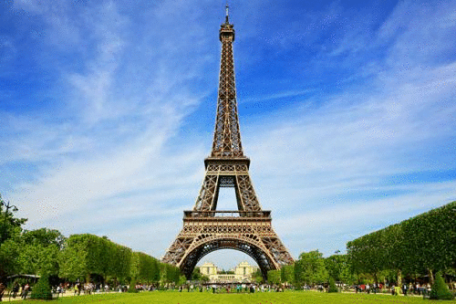

# Implementation of 'A Neural Algorithm of Artistic Style'

This is a Torch7 implementation of the method described in the paper 
'A Neural Algorithm of Artistic Style' by Leon Gatys, Alexander Ecker, and Matthias Bethge (http://arxiv.org/abs/1508.06576).



[(Longer animation)](http://gfycat.com/UnawareUnfortunateEkaltadeta)

## Dependencies

- [Torch7](https://github.com/torch/torch7)
- [imagine-nn](https://github.com/szagoruyko/imagine-nn) (for Inception network)
- CUDA 6.5+ (unless running on CPU -- see below)

imagine-nn (and any other Torch packages you're missing) can be installed via Luarocks:

```
luarocks install inn
```

## Usage

First, download the models by running the download script:

```
bash download_models.sh
```

This downloads the model weights for the VGG and Inception networks.

Basic usage:

```
qlua main.lua --style <style.jpg> --content <content.jpg> --style_factor <factor>
```

where `style.jpg` is the image that provides the style of the final generated image, and `content.jpg` is the image that provides the content. `style_factor` is a constant that controls the degree to which the generated image emphasizes style over content. By default it is set to 2E9.

This generates an image using the VGG-19 network by Karen Simonyan and Andrew Zisserman (http://www.robots.ox.ac.uk/~vgg/research/very_deep/).

Other options:

- `model`: {inception, vgg}. Convnet model to use. Inception refers to Google's [Inception architecture](http://arxiv.org/abs/1409.4842). Default is VGG.
- `num_iters`: Number of optimization steps. Default is 500.
- `size`: Long edge dimension of the generated image. Set to 0 to use the size of the content image. Default is 500.
- `display_interval`: Number of iterations between image displays. Set to 0 to suppress image display. Default is 20.
- `smoothness`: Constant that controls the smoothness of the generated image (total variation norm regularization strength). Useful when using Inception model (set to ~5E-3). Default is 0.
- `init`: {image, random}. Initialization mode for the optimized image. `image` initializes with the content image; `random` initializes with random Gaussian noise. Default is `image`.
- `backend`: {cunn, cudnn}. Neural network CUDA backend. `cudnn` requires the [Torch bindings](https://github.com/soumith/cudnn.torch/tree/R3) for CuDNN R3.
- `optimizer`: {sgd, lbfgs}. Optimization algorithm. `lbfgs` is slower per iteration and consumes more memory, but may yield better results. Default is `lbfgs`.
- `cpu`: Optimize on CPU instead of GPU (only VGG model supported).

### Out of memory?

The VGG network with the default L-BFGS optimizer gives the best results. However, this setting also requires a lot of GPU memory. If you run into CUDA out-of-memory errors, try running with the Inception architecture or with the SGD optimizer:

```
qlua main.lua --style <style.jpg> --content <content.jpg> --model inception --optimizer sgd
```

You can also try reducing the size of the generated image:

```
qlua main.lua --style <style.jpg> --content <content.jpg> --size 300
```

If all else fails (or if you don't have a CUDA-compatible GPU), you can optimize on CPU:

```
qlua main.lua --style <style.jpg> --content <content.jpg> --cpu
```

## Examples

The Eiffel Tower in the style of Edvard Munch's *The Scream*:


[(Longer animation)](http://gfycat.com/WebbedValuableGreyhounddog)

Picasso-fied Obama:


[(Longer animation)](http://gfycat.com/WeakPettyDevilfish)

## Implementation Details

When using the Inception network, the outputs of the following layers are used to optimize for style: `conv1/7x7_s2`, `conv2/3x3`, `inception_3a`, `inception_3b`, `inception_4a`, `inception_4b`, `inception_4c`, `inception_4d`, `inception_4e`.

The outputs of the following layers are used to optimize for content: `inception_3a`, `inception_4a`.

By default, the optimized image is initialized using the content image; the implementation also works with white noise initialization, as described in the paper.

In order to reduce high-frequency "screen door" noise in the generated image (especially when using the Inception network), total variation regularization is applied (idea from [cnn-vis](https://github.com/jcjohnson/cnn-vis) by [jcjohnson](https://github.com/jcjohnson)).

## Acknowledgements

The weights for the Inception network used in this implementation were ported to Torch from the publicly-available [Caffe](https://github.com/BVLC/caffe/tree/master/models/bvlc_googlenet) distribution.

Thanks to the [Bethge Group](http://bethgelab.org/deepneuralart/) for providing the weights to the normalized VGG network used here.
