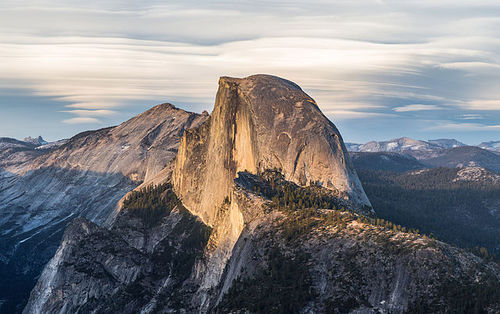
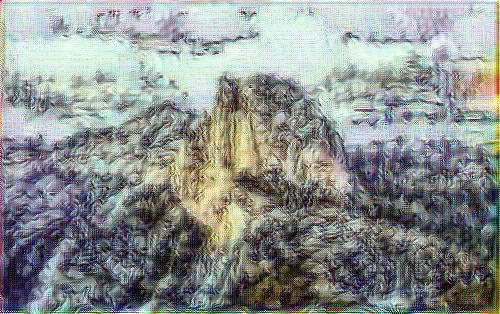
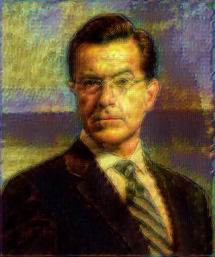

# Implementation of 'A Neural Algorithm of Artistic Style'

This is a Torch7 implementation of the method described in the paper 
'A Neural Algorthm of Artistic Style' by Leon Gatys, Alexander Ecker, and Matthias Bethge (http://arxiv.org/abs/1508.06576).

## Dependencies

- [Torch7](https://github.com/torch/torch7)
- [imagine-nn](https://github.com/szagoruyko/imagine-nn)
- CUDA 6.5+

imagine-nn (and any other Torch packages you're missing) can be installed via Luarocks:

```
luarocks install inn
```

## Usage

Basic usage:

```
qlua main.lua --style <style.jpg> --content <content.jpg> --style_factor <factor>
```

where `style.jpg` is the image that provides the style of the final generated image, and `content.jpg` is the image that provides the content. `style_factor` is a constant that controls the degree to which the generated image emphasizes style over content. By default it is set to 5E9.

The optimization of the generated image is performed on GPU. On a 2014 MacBook Pro with an NVIDIA GeForce GT 750M, it takes a little over 4 minutes to perform 500 iterations of gradient descent.

Other options:

- `num_iters`: Number of optimization steps.
- `size`: Long edge dimension of the generated image. Set to 0 to use the size of the content image.
- `nodisplay`: Suppress image display during optimization.
- `init`: {image, random}. Initialization mode for optimized image. `image` initializes with the content image; `random` initializes with random Gaussian noise.
- `backend`: {cunn, cudnn}. Neural network CUDA backend. `cudnn` requires the [Torch bindings](https://github.com/soumith/cudnn.torch/tree/R3) for CuDNN R3.

## Examples

The Eiffel Tower in the style of Van Gogh's *Starry Night*:


[Longer animation](http://gfycat.com/UnawareUnfortunateEkaltadeta)

And in the style of Edvard Munch's *The Scream*:


[Longer animation](http://gfycat.com/WebbedValuableGreyhounddog)

Half Dome in the style of a Chinese painting:





[Animation](http://gfycat.com/DiscreteSnivelingCod)

Stephen Colbert in the style of the Mona Lisa:




[Animation](http://gfycat.com/GiddyWeirdFlycatcher)

## Implementation Details

The primary difference between this implementation and the paper is that it uses Google's Inception architecture instead of VGG. Consequently, the hyperparameter settings differ from those given in the paper (they have been tuned to give aesthetically pleasing results).

The outputs of the following layers are used to optimize for style: `conv1/7x7_s2`, `conv2/3x3`, `inception_3a`, `inception_3b`, `inception_4a`, `inception_4b`, `inception_4c`, `inception_4d`, `inception_4e`.

The outputs of the following layers are used to optimize for content: `inception_3a`, `inception_4a`.

Optimization of the generated image is performed using SGD with momentum of 0.9. The learning rate is decayed exponentially by 0.9 every 200 iterations.

By default, the optimized image is initialized using the content image; the implementation also works with white noise initialization, as described in the paper.

## Acknowledgements

The weights for the Inception network used in this implementation were ported to Torch from the publicly-available [Caffe](https://github.com/BVLC/caffe/tree/master/models/bvlc_googlenet) distribution.

